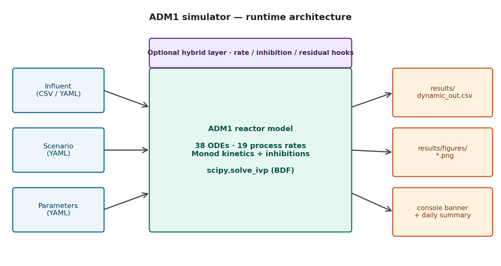
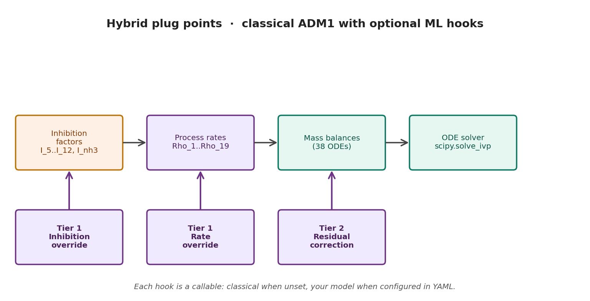

# ADM1 Reactor Simulation

A Python implementation of the **Anaerobic Digestion Model No. 1** (ADM1).
Adapted from [PyADM1](https://github.com/CaptainFerMag/PyADM1), restructured
for clearer configuration, modular code, and **plug-and-play hybrid models**
(classical ADM1 + your ML, no code changes required).



---

## 📖 Where to start

| You want to … | Read |
| --- | --- |
| **Run the simulator** | [Quick start](#-quick-start) below |
| **Understand the biology** (no biology background required) | [docs/adm1_biology.md](docs/adm1_biology.md) |
| **Plug an ML model in** (sklearn / PyTorch / lookup / …) | [docs/hybrid.md](docs/hybrid.md) + [examples/](examples/) |
| **Save & load a trained model** | [models/README.md](models/README.md) |
| **Browse the project structure** | [§ Project structure](#-project-structure) |

**Authors**
- Margaux Bonal — <margaux.bonal@inrae.fr>
- David Camilo Corrales — <David-Camilo.Corrales-Munoz@inrae.fr>

---

## 🚀 Quick start

```bash
git clone https://github.com/stamm-4m/model-adm1.git
cd model-adm1
python -m venv .venv && source .venv/bin/activate     # or .venv\Scripts\activate on Windows
pip install -r requirements.txt
python main.py
```

Default scenario is `BSM2_dynamic` — a reference mesophilic run. Pick a
different one by changing `active_scenario:` at the top of
[`configs/Scenario.yaml`](configs/Scenario.yaml).

Outputs:
- `results/dynamic_out.csv` — full state trajectory
- `results/figures/biogas.png`, `biomass.png`, `pH_alkalinity.png` — diagnostic plots

---

## 📁 Project structure

```
model-adm1/
├── main.py                                # entry point
├── initial_states.py                      # initial state vector (38 ADM1 states)
├── requirements.txt
│
├── configs/                               # all configuration is YAML
│   ├── adm1_parameters.yaml               # intrinsic ADM1 kinetic / stoichiometric parameters
│   ├── Initial_states.yaml                # named initial state sets (BSM2, ...)
│   ├── Influent.yaml                      # influent definitions (CSV time series or constant)
│   ├── Scenario.yaml                      # active-scenario selector + per-scenario overrides
│   ├── Simulation.yaml                    # ODE solver settings, time horizon, output
│   ├── Calibration.yaml                   # calibration framework (free parameters, bounds)
│   ├── digester_influent.csv              # raw influent data
│   └── daily_averages.csv                 # daily-averaged BSM2 dynamic influent
│
├── src/
│   ├── reactor.py                         # ADM1 ODE system, mass balances
│   ├── parameters.py                      # parameter loader (with scenario overrides)
│   ├── influent.py                        # influent interface
│   ├── acid_base.py                       # acid-base equilibrium solver
│   └── hybrid.py                          # hybrid hooks + HybridSpec loader
│
├── plots/                                 # diagnostic plotting
│   ├── plot_biogas.py
│   ├── plot_biomass.py
│   └── plot_pH_alkalinity.py
│
├── examples/                              # plug-in examples for hybrid mode
│   ├── README.md
│   ├── hybrid_rate_example.py             # Tier 1 — replace a process rate
│   ├── hybrid_inhibition_example.py       # Tier 1 — replace an inhibition factor
│   ├── hybrid_residual_example.py         # Tier 2 — residual on dy/dt
│   └── hybrid_linear_regression_example.py  # real ML — linear regression for Rho_2
│
├── models/                                # trained hybrid model artefacts
│   ├── README.md                          # save recipes (linear_lstsq, sklearn, ...)
│   ├── rho2.spec.yaml                     # HybridSpec sidecar (declarative)
│   └── rho2.npz                           # model artefact (LR coefficients)
│
├── docs/                                  # extended documentation
│   ├── README.md
│   ├── adm1_biology.md                    # ADM1 biology for computer scientists
│   ├── hybrid.md                          # full hybrid-mode guide
│   ├── images/                            # rendered diagrams (committed)
│   └── scripts/render_diagrams.py         # regenerate the diagrams
│
└── results/                               # outputs
    └── dynamic_out.csv
```

---

## 🛠 Installation

Python 3.10 or newer is recommended.

### 1. Clone

```bash
git clone https://github.com/stamm-4m/model-adm1.git
cd model-adm1
```

### 2. Create and activate a virtual environment

| Platform | Commands |
| --- | --- |
| **Linux / macOS** | `python3 -m venv .venv && source .venv/bin/activate` |
| **Windows (PowerShell)** | `python -m venv .venv` then `.\.venv\Scripts\Activate.ps1` |
| **Windows (cmd.exe)** | `python -m venv .venv` then `.\.venv\Scripts\activate.bat` |

### 3. Install dependencies

```bash
pip install --upgrade pip
pip install -r requirements.txt
```

| Package    | Purpose                              |
| ---------- | ------------------------------------ |
| NumPy      | numerical operations, state vectors  |
| SciPy      | ODE solver (`solve_ivp`)             |
| Pandas     | influent CSV / results handling      |
| Matplotlib | diagnostic plots                     |
| PyYAML     | configuration loading                |

The simulator is configured entirely through YAML files in [`configs/`](configs/);
no environment variables are required.

---

## ▶️ Running the simulation

1. **Pick a scenario** in [`configs/Scenario.yaml`](configs/Scenario.yaml) by setting `active_scenario:`. Provided scenarios:

   | Scenario | What it does |
   | --- | --- |
   | `BSM2_dynamic` | Reference BSM2 mesophilic run with daily dynamic influent |
   | `BSM2_constant` | Same, but with a constant-value influent |
   | `thermophilic` | 55 °C operation with higher NH₃ inhibition constant |
   | `batch_validation` | Batch mode (zero feed flow) — useful for validating kinetics |
   | `hybrid_demo` | Tier 1 + 2 hybrid hooks via raw Python callables (see [docs/hybrid.md](docs/hybrid.md)) |
   | `hybrid_lr_demo` | A real linear-regression model replaces `Rho_2`, loaded from `examples/` |
   | `hybrid_lr_spec_demo` | Same model loaded via a `HybridSpec` sidecar in `models/` |
   | `pig_slurry_test` | Pig-slurry feedstock under mesophilic conditions |

2. **Provide influent data** in [`configs/Influent.yaml`](configs/Influent.yaml):
   - `dynamic` — CSV time series (default: `configs/daily_averages.csv`)
   - `constant` — fixed values defined directly in the YAML

3. **Tune the solver and outputs** in [`configs/Simulation.yaml`](configs/Simulation.yaml).
   Reference parameters live in [`configs/adm1_parameters.yaml`](configs/adm1_parameters.yaml)
   and can be overridden per scenario via `parameter_overrides:` in `Scenario.yaml`.

4. **Run**:

   ```bash
   python main.py
   ```

Results are written to `results/dynamic_out.csv`. Diagnostic figures
(biogas, biomass, pH/alkalinity) are saved to `results/figures/` when
`save_figures: true` in `Simulation.yaml`.

---

## 🤖 Hybrid mode — ADM1 + your ML model

You can run the simulator either as **pure ADM1** (default) or as a
**hybrid model** by adding a `hybrid:` block to your scenario in
`configs/Scenario.yaml`. **No code changes are required.**



Three plug points are available, all optional:

| Plug point | Tier | What you can replace |
| --- | --- | --- |
| **Inhibition override** | 1 | one of `I_5..I_12, I_nh3` |
| **Rate override** | 1 | one of `Rho_1..Rho_19` (the 19 process rates) |
| **Residual correction** | 2 | additive learned correction on `dy/dt` for any state |

Each hook is a Python callable. The simulator loads it at startup from a YAML reference, in either of two forms:

- **Raw callable** — point at any function: `"my_pkg.my_module:my_function"` or `"./path/to/file.py:my_function"`.
- **HybridSpec sidecar** — point at a saved trained model: `"models/my_rho.spec.yaml"` (the simulator loads the artefact for you).

To try it, set `active_scenario: hybrid_demo` (or one of the `hybrid_lr_*`
scenarios) in `configs/Scenario.yaml` and run `python main.py`. The
startup banner will report which hooks were wired in.

**Reading order**:
1. [docs/hybrid.md](docs/hybrid.md) — full guide: signatures, schema, integration contract.
2. [examples/](examples/) — four worked examples covering all three plug points.
3. [models/README.md](models/README.md) — save recipes for `linear_lstsq`, `sklearn`, and how to add a new backend.

---

## 🆚 Compared to the original PyADM1

This adaptation introduces:

- Modular project structure (separate concerns: model, parameters, influent, scenarios).
- YAML-based configuration (no more hand-editing parameter dicts).
- CSV-based influent preprocessing.
- Per-scenario overrides for temperature, kinetics, and operating conditions.
- **Plug-and-play hybrid hooks** (rate / inhibition / residual) — see above.
- Three diagnostic plots tuned for AD operators (biogas, biomass populations, pH & VFA/alk stability).

Three internal bug fixes vs the original PyADM1 are documented in the
[`src/reactor.py`](src/reactor.py) module header.

---

## 📜 License

[Apache 2.0](LICENSE).
