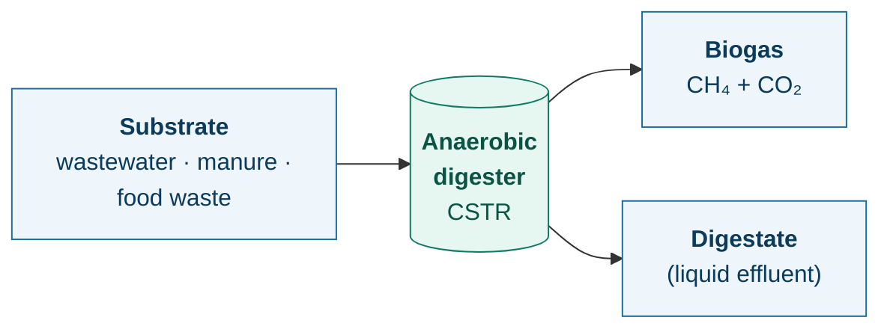
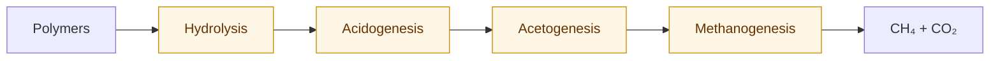
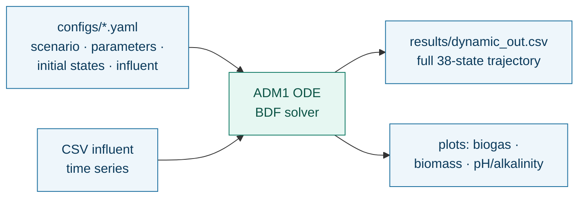
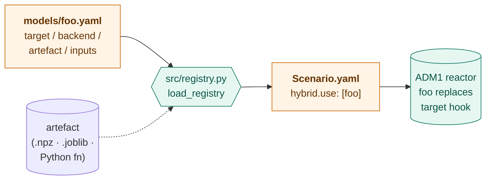

# ADM1 — Anaerobic Digestion Model No. 1

A Python implementation of **ADM1**, with first-class hooks for plugging
ML models in. Adapted from [PyADM1](https://github.com/CaptainFerMag/PyADM1).

**Authors**
- Margaux Bonal — <margaux.bonal@inrae.fr>
- David Camilo Corrales — <David-Camilo.Corrales-Munoz@inrae.fr>

---

## Anaerobic digestion in 30 seconds (for ML/CS readers)

A reactor full of microbes turns organic waste into **biogas** (methane).
ADM1 is the standard mathematical model of that reactor — a system of
**38 coupled ODEs** describing concentrations of substrates, microbial
populations, dissolved gases, and ions.


```mermaid
flowchart LR
    feed["<b>Substrate</b><br/>wastewater · manure ·<br/>food waste"]
    bio[("<b>Anaerobic<br/>digester</b><br/>CSTR")]
    biogas["<b>Biogas</b><br/>CH₄ + CO₂"]
    digestate["<b>Digestate</b><br/>(liquid effluent)"]
    feed --> bio
    bio --> biogas
    bio --> digestate

    classDef io fill:#eef6fb,stroke:#1a6e9e,color:#0b3a5b
    classDef tank fill:#e6f7f2,stroke:#117a65,color:#0b5345
    class feed,biogas,digestate io
    class bio tank
```

Inside the reactor, organic matter flows through four biochemical stages
in series, each performed by a different group of microbes:


```mermaid
flowchart LR
    s[Polymers] --> h[Hydrolysis] --> a[Acidogenesis] --> ac[Acetogenesis] --> m[Methanogenesis] --> ch4[CH₄ + CO₂]
    classDef stage fill:#fff7e6,stroke:#cc8800,color:#663300
    class h,a,ac,m stage
```

Each stage's rate is **Monod kinetics** gated by inhibition factors (pH,
NH₃, H₂). The full math + CS-friendly walkthrough is in
[docs/adm1_biology.md](docs/adm1_biology.md).

---

## What this simulator does


```mermaid
flowchart LR
    cfg[configs/*.yaml<br/>scenario · parameters ·<br/>initial states · influent] --> sim
    inf[CSV influent<br/>time series] --> sim[ADM1 ODE<br/>BDF solver]
    sim --> csv[results/dynamic_out.csv<br/>full 38-state trajectory]
    sim --> plots[plots: biogas ·<br/>biomass · pH/alkalinity]

    classDef io fill:#eef6fb,stroke:#1a6e9e,color:#0b3a5b
    classDef core fill:#e6f7f2,stroke:#117a65,color:#0b5345
    class cfg,inf,csv,plots io
    class sim core
```

Stack: Python ≥ 3.10, NumPy, SciPy, Pandas, Matplotlib, PyYAML.

---

## Quick start

```bash
git clone https://github.com/stamm-4m/model-adm1.git
cd model-adm1
python -m venv .venv && .venv\Scripts\activate     # Linux/macOS: source .venv/bin/activate
pip install -r requirements.txt
python main.py
```

Default scenario is `BSM2_dynamic` (mesophilic reference run). Pick a
different one in `configs/Scenario.yaml`. Outputs land in `results/`.

---

## Hybrid mode — drop in your ML model

Each hybrid component is a YAML file under `models/`. The directory **is**
the registry. Scenarios reference models by name.


```mermaid
flowchart LR
    yaml["<b>models/foo.yaml</b><br/>target / backend /<br/>artefact / inputs"]
    art[("artefact<br/>(.npz · .joblib ·<br/>Python fn)")]
    reg{{src/registry.py<br/>load_registry}}
    sc["<b>Scenario.yaml</b><br/>hybrid.use: [foo]"]
    rx[("ADM1 reactor<br/>foo replaces<br/>target hook")]
    yaml --> reg
    art -.-> reg
    reg --> sc
    sc --> rx

    classDef yaml fill:#fff4e6,stroke:#cc6600,color:#663300
    classDef code fill:#e6f7f2,stroke:#117a65,color:#0b5345
    class yaml,sc yaml
    class reg,rx code
```

Three plug points, all optional:

| Tier | Target syntax       | Replaces                                    |
| ---- | ------------------- | ------------------------------------------- |
| 1    | `Rho_1 .. Rho_19`   | one of the 19 process rates                 |
| 1    | `I_5..I_12, I_nh3`  | one of the inhibition factors               |
| 2    | `residual:<state>`  | UDE-style additive correction on `dy/dt`    |

Three built-in backends: `callable` (any Python function), `linear_lstsq`
(NumPy `.npz`), `sklearn` (joblib).

```bash
python main.py --list-models       # registered models
python main.py --list-hooks        # available plug points
```

Full guide: [docs/hybrid.md](docs/hybrid.md). Recipes for each backend:
[models/README.md](models/README.md). Worked examples:
[examples/](examples/).

---

## Project structure

```
model-adm1/
├── main.py                      # entry point
├── initial_states.py            # 38-state initial vector
├── configs/                     # YAML configuration (one file per concern)
├── src/
│   ├── reactor.py               # ADM1 ODEs, mass balances, 19 process rates
│   ├── parameters.py            # parameter loader + scenario overrides
│   ├── influent.py              # influent interface
│   ├── acid_base.py             # DAE: pH, HCO₃⁻, NH₃ equilibrium
│   ├── hybrid.py                # registry → reactor wiring
│   └── registry.py              # models/*.yaml loader + --list-* commands
├── models/                      # hybrid-model registry (one YAML per model)
├── examples/                    # four hybrid examples (rate, inhibition, residual, LR)
├── plots/                       # diagnostic plotting
└── docs/                        # extended docs (biology, configuration, hybrid)
```

---

## Where to go next

| You want to …                                     | Read |
| ------------------------------------------------- | ---- |
| Understand the biology (CS framing)               | [docs/adm1_biology.md](docs/adm1_biology.md) |
| Understand the YAML configuration                 | [docs/configuration.md](docs/configuration.md) |
| Plug in your ML model                             | [docs/hybrid.md](docs/hybrid.md) |
| Save / load a trained model                       | [models/README.md](models/README.md) |
| See worked plug-in examples                       | [examples/README.md](examples/README.md) |

---

## License

[Apache 2.0](LICENSE).
