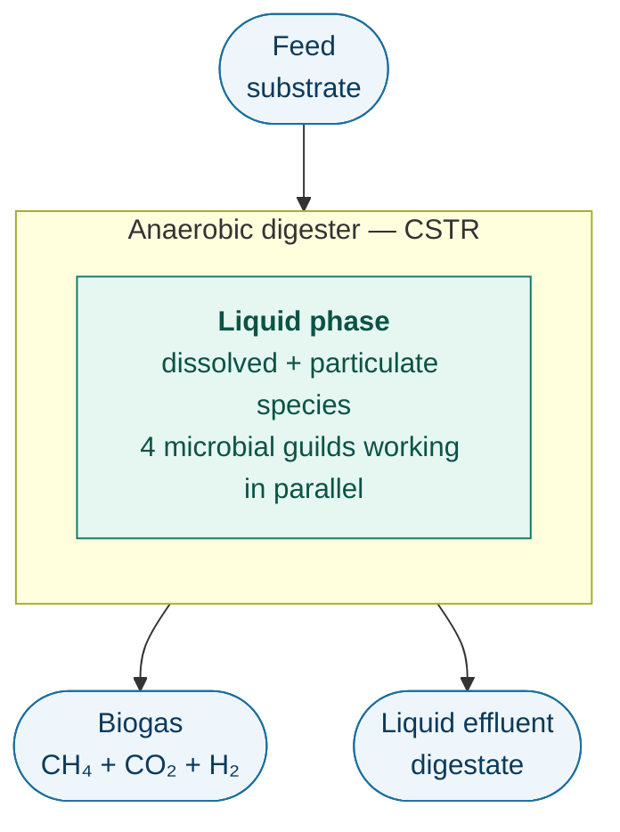
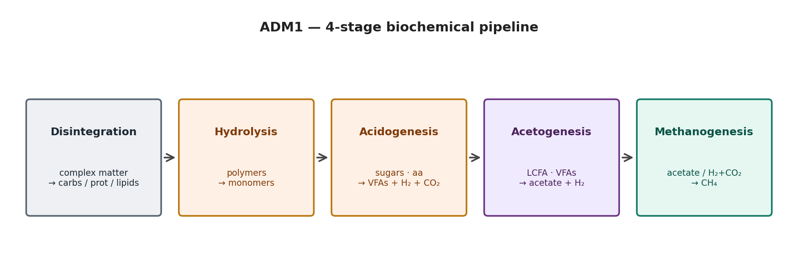

# ADM1 — The Biology, Explained for Computer Scientists

**Authors:** Margaux Bonal, David Camilo Corrales
**Audience:** software engineers / data scientists / CS students who need to
understand *what* ADM1 models before diving into the code.

This document is a one-stop introduction to the biology of the
**Anaerobic Digestion Model No. 1 (ADM1)** — using analogies, data structures
and pseudocode that a CS reader will recognise. It does **not** replace the
canonical IWA reference (Batstone et al., 2002), but it should let you read
[`src/reactor.py`](../src/reactor.py) without first taking a microbiology
course.

---

## 1. What is anaerobic digestion?

**Anaerobic digestion (AD)** is the biological process where micro-organisms
break down organic matter **in the absence of oxygen** and produce
**biogas** (mostly CH₄ + CO₂) plus a stabilised digestate.

In industry it is used to:

- treat wastewater, agricultural slurry, food waste,
- recover energy as renewable methane,
- reduce sludge volumes from sewage treatment plants.

From a CS standpoint, AD is essentially a **biochemical pipeline** running
inside a continuously-stirred tank reactor (CSTR):



ADM1 is the **standard mathematical model** of what happens inside that box.
It was published by the IWA Task Group in 2002 and has become the de-facto
"Linux kernel" of anaerobic-digestion modelling — open, complex, and what
every other model is forked from.

---

## 2. The 4-stage pipeline

ADM1 decomposes the conversion of organic matter into **4 sequential
biochemical stages**, each performed by a different group of micro-organisms.
Think of it as a 4-stage processing pipeline where each stage's output is
the next stage's input:



| # | Biochemical stage | What happens (in plain English) | Performed by |
|---|---|---|---|
| 0 | **Disintegration** | Bulk composite particulate matter (dead cells, food waste) is broken into carbohydrates, proteins, lipids, and inerts. *Mostly physical / enzymatic, not microbial.* | (extracellular) |
| 1 | **Hydrolysis** | Polymers → monomers: carbohydrates → sugars, proteins → amino acids, lipids → long-chain fatty acids (LCFA). | extracellular enzymes |
| 2 | **Acidogenesis** | Sugars and amino acids are fermented into volatile fatty acids (VFAs: valerate, butyrate, propionate, acetate), plus H₂ and CO₂. | acidogens (`X_su`, `X_aa`) |
| 3 | **Acetogenesis** | The "long" VFAs (LCFA, valerate, butyrate, propionate) are oxidised into acetate + H₂. **Energetically very tight — only works if H₂ stays low.** | acetogens (`X_fa`, `X_c4`, `X_pro`) |
| 4 | **Methanogenesis** | The final step. Two pathways in parallel: <br>• **acetoclastic**: CH₃COO⁻ → CH₄ + CO₂  <br>• **hydrogenotrophic**: 4 H₂ + CO₂ → CH₄ + 2 H₂O | methanogens (`X_ac`, `X_h2`) |

A useful mental model: each stage is a **transformation function**, the
microbes are **stateful workers**, and the H₂ partial pressure acts as a
back-pressure signal coupling stage 3 to stage 4 (more on that below).

---

## 3. The state vector — 38 floats that describe a digester

In ADM1 the entire reactor is represented as a vector
`y ∈ ℝ³⁸` of concentrations. The ODE solver evolves it in time.

The state variables fall into 5 logical groups:

```python
# pseudo-code view of the ADM1 state
state = {
    # --- 1. dissolved substrates / products ---
    "S_su":  ...,   # monosaccharides     [kg COD / m^3]
    "S_aa":  ...,   # amino acids
    "S_fa":  ...,   # long-chain fatty acids
    "S_va":  ...,   # valerate
    "S_bu":  ...,   # butyrate
    "S_pro": ...,   # propionate
    "S_ac":  ...,   # acetate
    "S_h2":  ...,   # dissolved hydrogen
    "S_ch4": ...,   # dissolved methane
    "S_IC":  ...,   # inorganic carbon (CO2 + HCO3-)
    "S_IN":  ...,   # inorganic nitrogen (NH3 + NH4+)
    "S_I":   ...,   # soluble inerts

    # --- 2. particulate substrates ---
    "X_xc":  ...,   # composite particulate
    "X_ch":  ...,   # carbohydrates
    "X_pr":  ...,   # proteins
    "X_li":  ...,   # lipids
    "X_I":   ...,   # particulate inerts

    # --- 3. biomass populations (the 7 microbial guilds) ---
    "X_su":  ...,   # sugar degraders
    "X_aa":  ...,   # amino-acid degraders
    "X_fa":  ...,   # LCFA degraders
    "X_c4":  ...,   # valerate + butyrate degraders
    "X_pro": ...,   # propionate degraders
    "X_ac":  ...,   # acetoclastic methanogens
    "X_h2":  ...,   # hydrogenotrophic methanogens

    # --- 4. ions (acid-base equilibrium) ---
    "S_cation":   ...,  # net strong cations
    "S_anion":    ...,
    "S_va_ion":   ...,  # dissociated VFA forms
    "S_bu_ion":   ...,
    "S_pro_ion":  ...,
    "S_ac_ion":   ...,
    "S_hco3_ion": ...,
    "S_co2":      ...,  # = S_IC - S_hco3_ion
    "S_nh3":      ...,
    "S_nh4_ion":  ...,
    "S_H_ion":    ...,  # → pH = -log10(S_H_ion)

    # --- 5. gas phase (head-space) ---
    "S_gas_h2":  ...,
    "S_gas_ch4": ...,
    "S_gas_co2": ...,
}
```

Convention: dissolved/particulate species are tracked in **kg COD / m³**
(chemical oxygen demand — a unit that makes electron balances trivial),
inorganic C/N use mol/m³, and the gas phase concentrations are converted
to bar via the ideal-gas law.

> **Why COD?** COD is conserved across redox reactions in the way that
> mass is *not*. Using it as the "currency" of organics is the same trick
> a programmer uses when they pick a single canonical unit (e.g. UTC, or
> bytes) so that conversions don't sneak in errors.

In code, this vector lives in [`src/reactor.py`](../src/reactor.py) — see
`FULL_STATE_NAMES` and `unpack_state()`.

---

## 4. The ODE — biology as a system of differential equations

For each state variable `i`, ADM1 writes a mass balance:

```
d S_i / dt   =   inflow_i  -  outflow_i  +  Σ_j  ν_ij · ρ_j
```

where:

- `inflow_i = q_in · S_i_in / V_liq`  — feed term,
- `outflow_i = q_out · S_i / V_liq`   — washout from the CSTR,
- `ρ_j` is the **rate** of biochemical process `j` (units: kg COD · m⁻³ · d⁻¹),
- `ν_ij` is the **stoichiometric coefficient** — how much of species `i` is
  produced or consumed per unit of process `j`.

ADM1 has **19 such processes** (`ρ_1 … ρ_19`): disintegration, three
hydrolyses, six uptake reactions, seven biomass-decay reactions, and two
gas-phase exchanges. The stoichiometric coefficients form a sparse matrix
ν that you can literally read off from the IWA report (Table 6.1 in
Batstone et al., 2002).

> **CS analogy:** each `ρ_j` is a function (a reaction rate); `ν` is a
> compile-time constant matrix; `dy/dt = ν · ρ(y) + flow_terms` is a single
> matrix-vector product evaluated thousands of times per simulated day by
> the ODE solver.

### 4.1 The shape of a microbial uptake rate

Most rates in ADM1 follow a **Monod kinetic** form:

```
ρ_uptake = k_m · ( S / (K_S + S) ) · X · I(state)
```

- `S` is the substrate concentration,
- `X` is the biomass concentration of the guild eating it,
- `k_m` is the maximum specific uptake rate,
- `K_S` is the half-saturation constant (the substrate level at which the
  rate is half of its max),
- `I(state) ∈ [0, 1]` is the **inhibition multiplier** (next section).

If you've seen software rate-limiters: Monod is the biological version of
a saturating throughput curve — at low load the worker pool is bored and
the rate is linear in `S`; at high load the workers are saturated and the
rate plateaus at `k_m · X`.

---

## 5. Inhibition — biology's feature flags

Microbes don't just die when conditions are bad; they *slow down*. ADM1
models this with **multiplicative inhibition factors**, each in `[0, 1]`,
that gate the uptake rates:

| Inhibition | Trigger | Affects | In code |
|---|---|---|---|
| **pH inhibition** | pH outside the species' tolerance window | all uptake rates | `I_pH_aa`, `I_pH_ac`, `I_pH_h2` |
| **Free-ammonia (NH₃)** | high `S_nh3` | acetoclastic methanogens | `I_nh3` |
| **Hydrogen** | high dissolved H₂ partial pressure | LCFA, butyrate, propionate degraders | `I_h2_fa`, `I_h2_c4`, `I_h2_pro` |
| **Nitrogen limitation** | very low `S_IN` | all biomass growth | `I_IN_lim` |

Effective rate:

```
ρ_eff = ρ_kinetic  ·  I_pH  ·  I_nh3  ·  I_h2  ·  I_IN_lim
```

This multiplicative form is why a digester can fail catastrophically: drop
the pH and *every* uptake rate is choked at once, but the biomass keeps
producing acids. That's the classic **acid crash** — a positive-feedback
loop, exactly the kind of thing engineers love (and operators hate).

> **CS analogy:** inhibition factors are runtime feature flags that
> decay continuously rather than flipping on/off. The sim stays
> differentiable, the solver stays stable.

---

## 6. The acid–base sub-system — an algebraic constraint

Some species (acetic acid / acetate, ammonia / ammonium, CO₂ / bicarbonate,
H⁺ / OH⁻) reach **chemical equilibrium far faster** than the biological
processes evolve. Solving them as ODEs would force the solver to take
microsecond steps, which is wasteful.

ADM1 instead computes them by solving an **electroneutrality equation**
algebraically at every step:

```
Σ cations  =  Σ anions
   ⇔
   S_cation + S_nh4 + S_H
       = S_anion + S_hco3 + S_ac_ion + S_pro_ion + S_bu_ion + S_va_ion + S_OH
```

This is the role of [`src/acid_base.py`](../src/acid_base.py) — given the
"slow" state (total inorganic carbon, total ammonia, total VFAs, ions),
it returns pH and all the dissociated species. From a CS standpoint this
is a **DAE** (differential-algebraic equation): `f(y, z) = 0` is solved
nested inside `dy/dt = g(y, z)`.

The pH it returns then feeds back into all the inhibition factors — that
is the coupling that makes anaerobic digestion non-trivial.

---

## 7. The gas phase

The reactor has a head-space of volume `V_gas` above the liquid. Three
gases (H₂, CH₄, CO₂) leave the liquid at a rate proportional to their
super-saturation:

```
ρ_T,gas = k_L_a · ( S_liq  -  K_H · p_gas )
```

- `k_L_a` is the gas-transfer coefficient (a property of the reactor, not
  the biology),
- `K_H` is Henry's-law solubility,
- `p_gas` is the partial pressure in the head-space.

The total head-space pressure drives the **biogas flow** out of the reactor:

```
q_gas = k_p · ( p_gas_total  -  p_atm )
```

This is what is reported as **methane production** — the headline number
the bio-engineer cares about.

---

## 8. Operating regime: temperature, residence time, scenarios

Two operational knobs dominate ADM1 behaviour:

- **Temperature `T_op`** — psychrophilic (<20 °C), mesophilic (~35 °C),
  thermophilic (~55 °C). The kinetic constants `k_m`, the Henry coefficients
  `K_H`, and the pKa's all depend on `T_op`.
- **Hydraulic retention time `HRT = V_liq / q_in`** — the average time a
  parcel of liquid spends in the reactor. If HRT < `1 / μ_max` for some
  guild, that guild **washes out** and the corresponding stage of the
  pipeline collapses. Methanogens, the slowest growers, are almost always
  the limiting guild.

These knobs are configured in [`configs/Scenario.yaml`](../configs/Scenario.yaml).
Different scenarios (`BSM2_dynamic`, `thermophilic`, `batch_validation`, …)
just override these knobs and feed compositions, without changing the
intrinsic ADM1 parameters.

---

## 9. How the biology maps to this codebase

| Biology / ADM1 concept | File | What lives there |
|---|---|---|
| 38-state vector, 19 processes, ODE right-hand side | [`src/reactor.py`](../src/reactor.py) | `ADM1Reactor`, `ADM1_ODE`, `compute_process_rates`, `compute_gas_transfer` |
| Acid–base algebraic loop (pH, HCO₃⁻, NH₃) | [`src/acid_base.py`](../src/acid_base.py) | `compute_acid_base_equilibrium`, `compute_total_cod` |
| Kinetic / stoichiometric / physico-chemical parameters | [`src/parameters.py`](../src/parameters.py) + [`configs/adm1_parameters.yaml`](../configs/adm1_parameters.yaml) | `ADM1Parameters` |
| Initial state vector for a given scenario | [`initial_states.py`](../initial_states.py) + [`configs/Initial_states.yaml`](../configs/Initial_states.yaml) | `InitialState`, `STATE_VARIABLES` |
| Influent (feed composition over time) | [`src/influent.py`](../src/influent.py) + [`configs/Influent.yaml`](../configs/Influent.yaml) | `Influent` (constant or dynamic CSV) |
| Solver settings (BDF, tolerances, time horizon) | [`configs/Simulation.yaml`](../configs/Simulation.yaml) | consumed by [`main.py`](../main.py) |
| Diagnostic plots (biogas, biomass, pH/alkalinity) | [`plots/`](../plots/) | reproduce the figures in `results/figures/` |

A single simulation run (in [`main.py`](../main.py)) is roughly:

```python
params   = ADM1Parameters(...)               # load parameters + scenario overrides
y0       = InitialState(...).get_vector()    # 38-D initial state
influent = Influent(...)                     # feed (constant or time-series)
reactor  = ADM1Reactor(params)               # holds the ODE RHS

sol = scipy.integrate.solve_ivp(
    fun     = lambda t, y: reactor.ADM1_ODE(t, y, influent.get(t)),
    t_span  = (t_start, t_end),
    y0      = y0,
    method  = "BDF",       # stiff solver — ADM1 is very stiff
    rtol=1e-5, atol=1e-7,
)
# → sol.y is the trajectory of all 38 states over time
```

The solver of choice is **BDF** (backward differentiation formulas) because
ADM1 is **stiff**: gas exchange and acid–base happen on millisecond
timescales while biomass dynamics happen over days, and explicit solvers
would need ridiculously small steps to stay stable.

---

## 10. Common failure modes (and what they look like in the output)

Reading a simulation result is much easier if you know what biological
failure modes to look for:

| Symptom in output | Likely biological cause |
|---|---|
| pH drops below ~6.5, VFAs (`S_va`, `S_bu`, `S_pro`, `S_ac`) accumulate, biogas flow drops | **Acid crash** — methanogens out-paced by acidogens. Reduce loading rate. |
| `S_nh3` rises, `X_ac` decreases, `I_nh3` → 0 | **Ammonia inhibition** — high-protein feed (manure, slaughterhouse waste). |
| Biomass `X_*` slowly decays to zero, biogas tails off | **Washout** — HRT too short for that guild. Increase HRT or biomass retention. |
| `p_gas_h2` spikes, propionate `S_pro` accumulates | **H₂ build-up** — methanogens not keeping up; check temperature, pH, mixing. |

The diagnostic plots in [`plots/`](../plots/) are designed to make these
patterns visible at a glance.

---

## 11. Further reading

1. Batstone, D. J. *et al.* (2002). **Anaerobic Digestion Model No. 1 (ADM1)**.
   IWA Scientific and Technical Report No. 13. *(The canonical reference —
   read at least chapters 3 and 4.)*
2. Rosen, C., & Jeppsson, U. (2006). **Aspects on ADM1 Implementation
   within the BSM2 Framework.** Lund University.
3. Sadrmajd, P., Mannion, P., Howley, E., & Lens, P. N. L. (2021).
   *PyADM1: A Python Implementation of Anaerobic Digestion Model No. 1.*
   <https://doi.org/10.1101/2021.03.03.433746>
4. Yeghiazaryan, S., Capson-Tojo, G., Steyer, J.-P., et al. (2026).
   *Modeling Thermophilic Syntrophic VFA Oxidation Using Thermodynamic
   Principles.* <https://doi.org/10.1016/j.biortech.2026.134365>

---

## TL;DR for the reader in a hurry

- ADM1 simulates **how microbes turn organic waste into methane**, in a
  4-stage pipeline: hydrolysis → acidogenesis → acetogenesis → methanogenesis.
- The reactor's full state is **38 floats**: substrates, biomass populations,
  ions, gas-phase concentrations.
- Biology becomes math via **19 process rates** (Monod kinetics) modulated
  by **inhibition factors** for pH, NH₃, H₂.
- A small **algebraic system** computes pH and dissociated species at every
  step (the DAE part).
- The solver is **stiff BDF** — necessary because of the time-scale gap
  between gas/acid–base equilibria and biomass dynamics.
- Configure the scenario in [`configs/Scenario.yaml`](../configs/Scenario.yaml),
  run [`main.py`](../main.py), inspect the figures in `results/figures/`.
