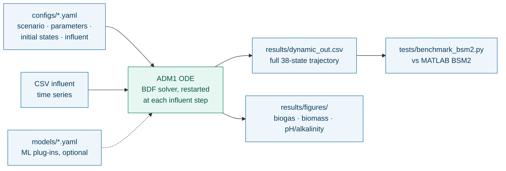
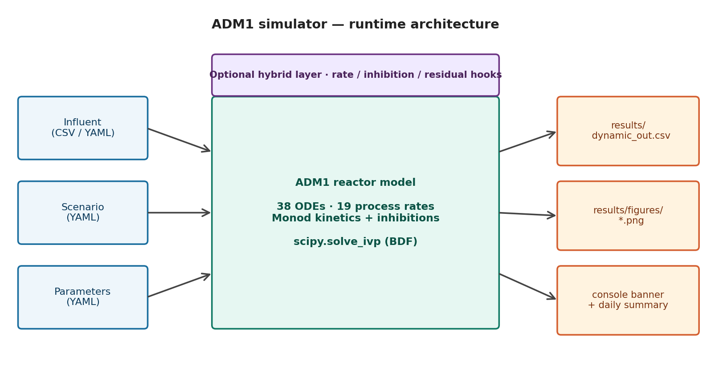

# Architecture — how a run flows through the code

## Modules

| file | role |
|---|---|
| `main.py` | entry point: loads the five YAMLs, builds the reactor, wires hybrid hooks, integrates piecewise over the influent steps, writes CSV + figures |
| `initial_states.py` | `InitialState`: 38-variable y0 from `Initial_states.yaml` (canonical `STATE_VARIABLES` order) |
| `src/parameters.py` | `ADM1Parameters`: flattens `adm1_parameters.yaml`, applies scenario `T_op` / `parameter_overrides` |
| `src/influent.py` | `Influent`: dynamic (CSV, optional `flow_column`) or constant feed; `get(step)` → `{..._in}` dict |
| `src/reactor.py` | `ADM1Reactor`: inhibitions, 19 process rates, gas transfer, 38 mass balances; T-dependent constants; hybrid hook points |
| `src/acid_base.py` | charge-balance solver (pH, HCO₃⁻, CO₂, NH₃, NH₄⁺, VFA ions) called inside every RHS evaluation; COD diagnostics |
| `src/registry.py`, `src/hybrid.py` | load `models/*.yaml`, resolve backends, attach overrides to the reactor |
| `plots/` | the three diagnostic figures |
| `tests/benchmark_bsm2.py` | BSM2 ring test against `tests/data/Matlabout_dyn.csv` |

## Numerical formulation
* 29 dynamic states integrated (26 liquid + 3 gas); the 9 acid-base states are algebraic and
  recomputed at every RHS call (DAE formulation of Rosen & Jeppsson 2006).
* S_h2 is integrated (stiff) → implicit solver required (`BDF` default).
* The feed is a zero-order hold; the integrator restarts at every influent row.
* Constants that depend on temperature (Henry, p_H2O, K_w, K_a_co2, K_a_IN) are recomputed
  from `T_op` at reactor construction.

Images in `images/` are rendered by `scripts/render_diagrams.py`.
