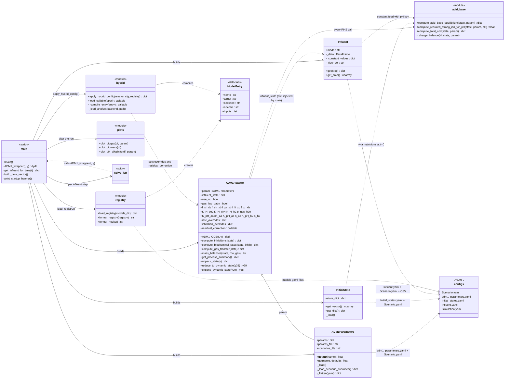
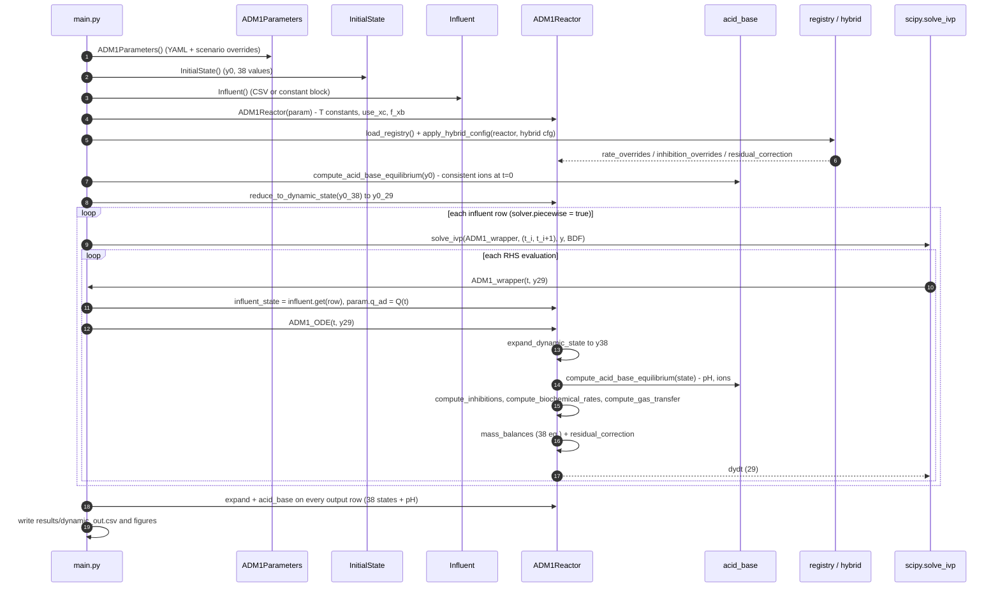

# Class diagram — model-adm1 from a software point of view

Five small classes, one orchestrating script, and a bag of pure functions. No inheritance anywhere;
everything is composed in `main.py`. Configuration (YAML) is the source of truth; the classes are thin
readers around it, and `ADM1Reactor` is the only object with real logic (the 38 ODEs).

## Reading guide

* **`Scenario.yaml` is the switchboard.** `ADM1Parameters`, `InitialState` and `Influent` each open it
  only to read `active_scenario` and pick their own block (`parameter_overrides` / `initial_states` /
  `influent_mode`). They never talk to each other.
* **`ADM1Parameters` is a flat `dict` with attribute access** (`param.k_dis`, `param.use_xc`). Priority:
  scenario `parameter_overrides` > scenario `T_op` > `adm1_parameters.yaml`. The reactor also *writes*
  into it (`K_w`, `K_a_co2`, `K_a_IN` recomputed from `T_op`; `q_ad` updated per feed row when the
  influent has a flow column).
* **`ADM1Reactor` is stateless between calls** except for the `influent_state` dict that `main` injects
  before every RHS evaluation and the `_last_*` caches used for logging. `ADM1_ODE` is the pipeline
  `acid_base → inhibitions → rates → gas → mass_balances`, with the three hybrid hook points in between.
* **Two state vectors.** The solver integrates 29 dynamic states (`y29`); the reactor works on the full
  38 (`y38`), the 9 acid–base states being recomputed algebraically at each call
  (`reduce_to_dynamic_state` / `expand_dynamic_state` convert).
* **`use_xc`** lives in `ADM1Parameters` (YAML) and is read once at reactor construction into
  `ADM1Reactor.use_xc`; it changes `Rho_1` and the decay routing in `mass_balances`.
* **`gas_law_patm`** is read the same way into `ADM1Reactor.gas_law_patm`; it only changes `q_gas` in
  `compute_gas_transfer` (and the same law in `compute_gas_flow_rate` / `compute_gas_outputs`, which
  produce the `q_gas*` CSV columns and the biogas plot).
* **Hybrid layer** = `registry` (reads `models/*.yaml` → `ModelEntry`) + `hybrid` (turns an entry into a
  Python callable and plugs it into `rate_overrides`, `inhibition_overrides` or `residual_correction`).
  With no `hybrid:` block in the scenario the reactor is pure ADM1.

## One simulation, as a sequence

