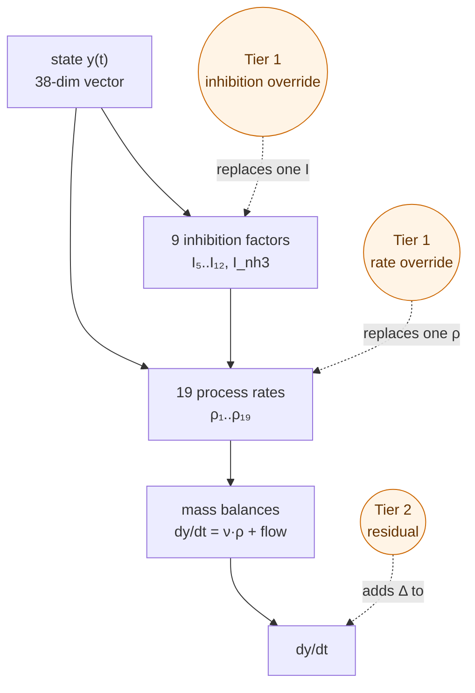
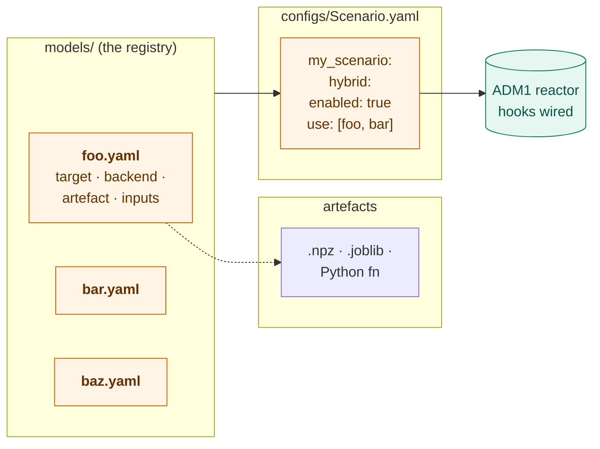

# Hybrid mode

Mix ADM1 with your ML models without touching any Python. Drop a YAML
under `models/`, reference it by name from a scenario.

---

## Where the hooks live



| Tier | Target syntax        | What you replace                                          |
| ---- | -------------------- | --------------------------------------------------------- |
| 1    | `Rho_1 .. Rho_19`    | one of the 19 process rates (Monod kinetics)              |
| 1    | `I_5..I_12, I_nh3`   | one of the inhibition factors (pH, NH₃, H₂, N-limit)      |
| 2    | `residual:<state>`   | UDE-style additive correction on `dy/dt` for one state    |

```bash
python main.py --list-hooks      # full plug-point catalog with descriptions
```

---

## How models, registry, and scenarios connect



The directory `models/` **is** the registry — one YAML per registered
model, filename stem = name.

---

## Scenario block

```yaml
my_scenario:
  initial_states: BSM2
  influent_mode: dynamic
  T_op: { value: 308.15, units: K }
  parameter_overrides: {}
  hybrid:
    enabled: true               # default false — omit for pure ADM1
    use: [foo, bar]             # any number of registered model names
```

Validation: unknown name, duplicate target on the same hook, or any
legacy key (`rate_overrides:` / `inhibition_overrides:` / `residual_correction:`)
raises a clear error at startup.

---

## Model YAML

```yaml
description: short, free-form        # shown by --list-models
target: Rho_2                        # see hook table above
backend: linear_lstsq                # callable | linear_lstsq | sklearn
artefact: foo.npz                    # path (relative to YAML) or "pkg.mod:fn"
inputs: [X_ch, T_op, pH]             # ML backends only — ordered feature names
metrics: { training_size: 2000 }     # free-form provenance
```

Full schema, backend-specific recipes, and metric-key suggestions:
[models/README.md](../models/README.md).

---

## Callable signatures (`backend: callable`)

| Target type                   | Signature                                              |
| ----------------------------- | ------------------------------------------------------ |
| `Rho_X`                       | `f(state: dict, inhib: dict, param) -> float`          |
| `I_X`                         | `f(state: dict, param) -> float` (return in `[0, 1]`)  |
| `residual:<state>`            | `f(t: float, state: dict, param) -> dict \| ndarray`   |

Where the args come from:

| `state`  | dict of all 38 states + acid-base species |
| -------- | ----------------------------------------- |
| `inhib`  | `{I_5, …, I_12, I_nh3}` (after any other overrides) |
| `param`  | `ADM1Parameters` — read `param.k_m_ac`, `param.T_op`, … |

For the residual, a dict returns `{state_name: dydt_delta}` (added to
the classical derivative).

One worked example per signature in [`../examples/`](../examples/).

---

## How ML features are resolved

For each name in `inputs:`, the loader pulls a value from the runtime context:

| Name                              | Source                                |
| --------------------------------- | ------------------------------------- |
| any of the 38 state variables     | `state[name]`                         |
| any of `I_5..I_12, I_nh3`         | `inhib[name]` *(rate overrides only)* |
| `T_op`                            | `param.T_op`                          |
| `pH`                              | `−log10(state["S_H_ion"])`            |
| any other `ADM1Parameters` attr   | `getattr(param, name)`                |

The order in `inputs:` is the order features hit your model. Saved
weights MUST match.

---

## Validating the wiring

Register the no-op residual from
[`../examples/hybrid_residual_example.py`](../examples/hybrid_residual_example.py)
and use it in a scenario. The output must be **bit-for-bit identical**
to pure ADM1. If it isn't, your wiring has a bug.

---

## Demo scenarios shipped

| Scenario              | What it activates                                                |
| --------------------- | ---------------------------------------------------------------- |
| `hybrid_demo`         | rate (Rho_11) + inhibition (I_nh3) + residual (S_ch4)            |
| `hybrid_lr_demo`      | Rho_2 replaced by a Python-callable linear regression            |
| `hybrid_lr_spec_demo` | Rho_2 replaced by a saved `.npz` artefact (`linear_lstsq` backend) |

Pick one with `active_scenario:` in `configs/Scenario.yaml`, then
`python main.py`.

---

## Limits

Tier 1 + 2 use your callables at **inference time** — not end-to-end
trainable. For neural-ODE training you'd need to port the right-hand
side to JAX/`diffrax` or PyTorch/`torchdiffeq`. Most hybrid use cases
(pre-trained model slotted in, residual learning, lookup tables) are
covered as-is.
