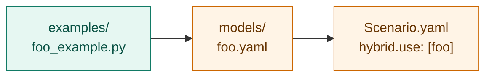

# Hybrid-mode examples

One worked example per plug-point type. Each is registered as a model
under [`../models/`](../models/) and wired into a demo scenario.



| Example                                                                                       | Tier | Plug point          | Registered as                                            |
| --------------------------------------------------------------------------------------------- | ---- | ------------------- | -------------------------------------------------------- |
| [hybrid_rate_example.py](hybrid_rate_example.py)                                              | 1    | `Rho_11`            | [`rho11_T_aware`](../models/rho11_T_aware.yaml)          |
| [hybrid_inhibition_example.py](hybrid_inhibition_example.py)                                  | 1    | `I_nh3`             | [`nh3_hill`](../models/nh3_hill.yaml)                    |
| [hybrid_residual_example.py](hybrid_residual_example.py)                                      | 2    | `residual:S_ch4`    | [`methane_bias`](../models/methane_bias.yaml)            |
| [hybrid_linear_regression_example.py](hybrid_linear_regression_example.py)                    | 1    | `Rho_2` (ML)        | [`rho2_lr_module`](../models/rho2_lr_module.yaml)        |

The committed [`rho2_lr_synthetic`](../models/rho2_lr_synthetic.yaml) uses
the same predictions but loaded as a saved `.npz` (`backend: linear_lstsq`)
— useful for A/B comparison between the two load paths.

## Demo scenarios

| Scenario              | Activates                                                |
| --------------------- | -------------------------------------------------------- |
| `hybrid_demo`         | `rho11_T_aware` + `nh3_hill` + `methane_bias`            |
| `hybrid_lr_demo`      | `rho2_lr_module` (Python callable LR)                    |
| `hybrid_lr_spec_demo` | `rho2_lr_synthetic` (saved `.npz` LR)                    |

```yaml
# configs/Scenario.yaml
active_scenario: hybrid_demo
```

```bash
python main.py
```

## Writing your own

Recipe + signatures: [`../models/README.md`](../models/README.md).
Validating wiring: register the `zero_residual` no-op from
[`hybrid_residual_example.py`](hybrid_residual_example.py) and confirm
the output is bit-for-bit identical to pure ADM1.
