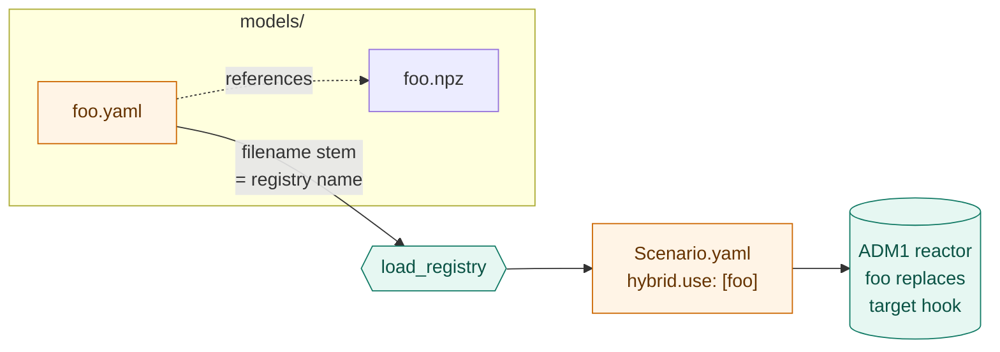

# `models/` — the hybrid-model registry

One YAML per registered model. The directory **is** the registry.



```bash
python main.py --list-models       # what's registered
python main.py --list-hooks        # what can be plugged into
```

---

## Schema

```yaml
description: >                       # free-form, shown by --list-models
  Linear regression for Rho_2 on plant data.
target: Rho_2                        # hook to replace
                                     #   Rho_1..Rho_19  |  I_5..I_12, I_nh3
                                     #   |  residual:<state>
backend: linear_lstsq                # callable | linear_lstsq | sklearn
artefact: foo.npz                    # ML backends: path (relative to YAML)
                                     # callable backend: "pkg.module:fn"
                                     #                or "path/to/file.py:fn"
inputs: [X_ch, T_op, pH]             # ML backends only — ordered feature names
metrics:                             # free-form provenance (all optional)
  training_size: 12000
  metric_mae: 0.04
  created_at: '2026-04-28'
```

---

## Backends

| Backend        | Artefact                                          | Deps                |
| -------------- | ------------------------------------------------- | ------------------- |
| `callable`     | `"pkg.module:fn"` or `"path/to/file.py:fn"`       | none                |
| `linear_lstsq` | `.npz` with key `coeffs` = `[b₀, b₁, …, bₙ]`      | NumPy only          |
| `sklearn`      | `.joblib` (anything with `.predict([[…]])`)       | `joblib`            |

---

## Recipes

### `callable` — fastest path

Write a Python function with the right [signature](../docs/hybrid.md#callable-signatures-backend-callable),
then:

```yaml
# models/my_inhib.yaml
description: Hand-coded Hill ammonia inhibition.
target: I_nh3
backend: callable
artefact: my_pkg.my_module:hill_nh3        # or "./scripts/foo.py:hill_nh3"
```

### `linear_lstsq` — NumPy only

```python
import numpy as np
# Phi shape: (n_samples, 1 + len(inputs)) with a leading column of ones
coeffs, *_ = np.linalg.lstsq(Phi, y, rcond=None)
np.savez("models/my_rho.npz", coeffs=coeffs)
```

```yaml
# models/my_rho.yaml
description: Linear regression for Rho_2 on plant data.
target: Rho_2
backend: linear_lstsq
artefact: my_rho.npz
inputs: [X_ch, T_op, pH]            # MUST match the design matrix column order
metrics: { training_size: 12000, metric_mae: 0.04 }
```

### `sklearn` — any estimator with `.predict`

```python
import joblib
from sklearn.ensemble import RandomForestRegressor
model = RandomForestRegressor(n_estimators=200, random_state=42).fit(X_train, y_train)
joblib.dump(model, "models/my_rho.joblib")
```

```yaml
# models/my_rho.yaml
target: Rho_2
backend: sklearn
artefact: my_rho.joblib
inputs: [X_ch, T_op, pH]
```

---

## Adding a new backend

Edit [`../src/hybrid.py`](../src/hybrid.py):

1. Add `_predict_<name>(artefact, x) -> float`.
2. Add a load branch in `_load_artefact`.
3. Register both in `_BACKEND_PREDICT`.

No other code changes needed.

---

## Committing

| File type                                              | Commit? |
| ------------------------------------------------------ | ------- |
| `*.yaml` registry entries                              | yes — defines the registry |
| Small `.npz` / `.joblib` (a few KB)                    | yes |
| Large checkpoints (PyTorch / ONNX, > a few MB)         | no — use Git LFS or a regeneration script |

---

## Recommended `metrics` keys

Schema-less, but a few keys help future-you:

| Key             | Why |
| --------------- | --- |
| `created_at`    | ISO-8601 of the training run |
| `training_data` | Path, dataset name, or content hash |
| `training_size` | Number of samples |
| `metric_*`      | Validation metrics (`metric_mae`, `metric_r2`, …) |
| `adm1_version`  | Git SHA of this repo at training time |
| `notes`         | Anything a future collaborator would want to know |
